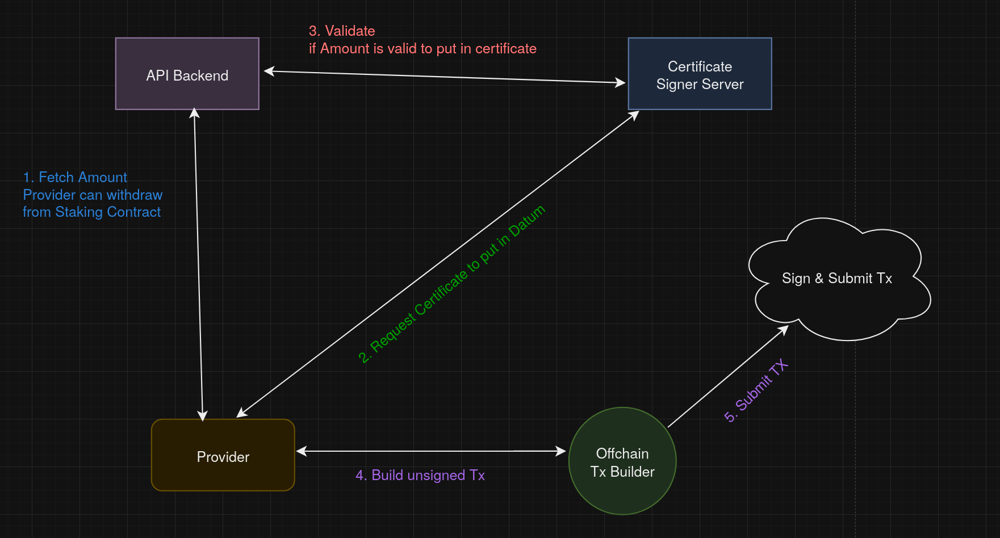

# Introduction

Staking in Iagon means token staked by `provider` to provide storage in the platform. Unlike Native cardano staking this is not liquid and locked by smart contract.


Provider will be able to `Request Withdraw`  and after 3 month of withdraw requested, provider can finally withdraw fund from Staking contract. This is necessery because platform will need time to backup storage from retiring provider.


For this process we need two contract, `Stake` and `Rewards`. Detail of each contract are explained further below.

# Process

At first Storage provider will stake IAG token and register their nodes. 

Our backend will keep track of every staked Utxo. This information is used to calculate reward for each Storage provider.

After we have all information about the amount of reward to distribute for all provider we place sufficient reward to one or many Utxos. When provider wants to claim reward from contract at first he will ask for certificate signed by our backend. This certificate gives exact amount of token provider can withdraw which is further checked in validator.

Both staking and reward claiming process can be traced by transaction in blockchain. All information for staking and reward claiming can be re checked by looking at the blockchain. Overall process is transparent.

# Staking Contract

```rust
    type Datum {
        providerKey: PubKeyHash,
        providerAddr: Address,
        locked_until: POSIXTime,
        staking_state: StakingState
    }

    data StakingState = StakingState{ Active | Retiring }
```
* ### Datum
    - `providerKey:`  Pubkey hash of provider. Transaction must be signed by same pubkey  for retiring staking & withdraw funds from staking. 

    - `providerAddr:` Address of provider. Funds will be sent to this address when withdrawl is completed. 
        > [!NOTE]
        > Maybe this is not needed as output will be collected by signer as change. 

    - `locked_until`: utxo is locked until specified time. provider can only consume utxo after this interval.

    - `staking_state`: State of staking utxo. Funds can be withdrawn only after staking state is in `Retiring` State


```rust
    type Reedemer{
        Retire  (Message, Signature)
        Withdraw(Message, Signature)
    }
```
* ### Reedemer
    - `Retire`: Request staking to retire. 
        * There must be continuing output to same contract address. 
        * Value in continuing output should also remain same as input.
        * Output datum should have same `providerKey` & `provider address`
        * Output datum must have `Retiring` staking state
        * Output datum `locked_until` must be after 3 month from now  


    - `Withdraw`: Withdraw fund from staking contract.
        * Certificate must be valid.
        * Value withdrawing must be valid.
        * staking state must be in retiring.
        * must be after locked_until

# Signature certificate

```rust
    type Certificate = {
        userKey: PubKeyHash,
        certUtxo: UtxoRef,
        value: Value,
        expires_in: POSIXTime
    }
```

* `userKey`: Pubkey hash of user signing transaction.
* `certUtxo`: Utxo that needs to be passed as input to transaction. This is needed to prevent reply attack.
* `value`: Value trying to consume from Utxo.
* `expires_in`: expiry date of certificate. tx must be onchain before certificate is expired. This is needed to check if it is good to issue new certificate.

>Todo! Add more description

# Overall Staking Architecture


* ### Withdraw Staking Process
